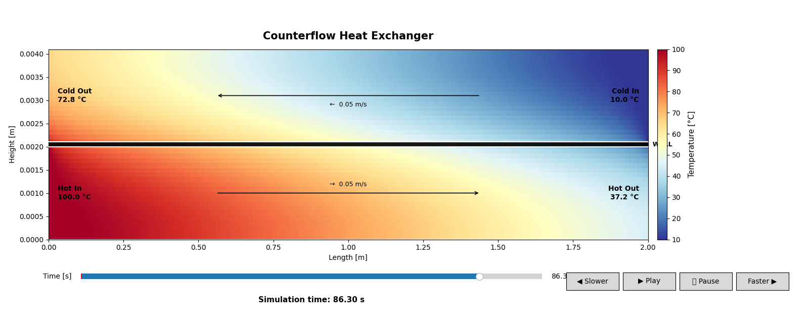

# 2D Counterflow Heat Exchanger Simulation

A two-dimensional numerical simulation of a counterflow heat exchanger implemented in Python using NumPy and Matplotlib.

The simulation considers two fluid channels separated by a thin copper wall. The hot fluid flows from left to right, while the cold fluid flows in the opposite direction. Heat is transferred between the fluids through the separating wall.

The main purpose of this project is to demonstrate the coupled effects of advection and heat conduction in a counterflow heat exchanger using a relatively simple numerical model.

The resulting temperature field can be explored interactively using a heatmap, time slider and playback controls.

## Physical Setup

The simulated heat exchanger consists of two rectangular fluid channels separated by a thin wall.

    Hot fluid
    ────────────────────────────>
    100 °C                    Hot Out

    ════════════════════════════
              COPPER
    ════════════════════════════

    <────────────────────────────
    Cold Out                  10 °C
             Cold fluid

The hot fluid enters the heat exchanger from the left at `100 °C`, while the cold fluid enters from the right at `10 °C`.

Both fluids are modeled using the thermophysical properties of water. The separating wall is modeled as copper.

## Material Properties

### Water

| Property | Value |
|---|---:|
| Density | `1000 kg/m³` |
| Specific heat capacity | `4180 J/(kg K)` |
| Thermal conductivity | `0.6 W/(m K)` |

### Copper

| Property | Value |
|---|---:|
| Density | `8960 kg/m³` |
| Specific heat capacity | `385 J/(kg K)` |
| Thermal conductivity | `400 W/(m K)` |

## Simulation Parameters

The current simulation uses the following parameters:

| Parameter | Value |
|---|---:|
| Heat exchanger length | `2.0 m` |
| Fluid channel height | `2.0 mm` |
| Wall thickness | `0.1 mm` |
| Hot fluid velocity | `0.05 m/s` |
| Cold fluid velocity | `-0.05 m/s` |
| Hot inlet temperature | `100 °C` |
| Cold inlet temperature | `10 °C` |
| Grid points in x-direction | `300` |
| Grid points in y-direction | `30` |
| Time step | `0.01 s` |
| Number of time steps | `15000` |
| Stored frame interval | `10` steps |

## Mathematical Model

The temperature evolution in the fluid regions is described by the transient advection-diffusion equation

$$
\rho c_p \left( \frac{\partial T}{\partial t} + \mathbf{u}\cdot\nabla T \right) = \nabla\cdot(k\nabla T).
$$

Here, $T$ denotes the temperature, $\rho$ the density, $c_p$ the specific heat capacity, $k$ the thermal conductivity and $\mathbf{u}$ the prescribed fluid velocity.

The equation contains two main contributions: advection and diffusion.

The advection term

$$
\mathbf{u}\cdot\nabla T
$$

describes the transport of thermal energy caused by the movement of the fluid.

The diffusion term

$$
\nabla\cdot(k\nabla T)
$$

describes heat transport caused by temperature gradients.

For the fluid regions, both contributions are present. In the wall, no fluid motion occurs and therefore the advection term vanishes. The temperature evolution in the copper wall is consequently described by

$$
\rho_w c_{p,w} \frac{\partial T}{\partial t} = \nabla\cdot(k_w\nabla T). $$

The different material properties are assigned locally to the corresponding regions of the computational domain.

## Spatial Discretization

The geometry is discretized using a regular two-dimensional Cartesian grid.

The second derivatives appearing in the diffusion term are approximated using central finite differences. For example, the second derivative in the $x$-direction is given by

$$ \frac{\partial^2 T}{\partial x^2} \approx \frac{ T_{i+1,j} -2T_{i,j} +T_{i-1,j} }{ \Delta x^2 }. $$

The equivalent expression is used in the $y$-direction.

The advection term is discretized using an upwind scheme. This means that the temperature at the upstream grid point is used to calculate the temperature transport.

For the hot fluid, which flows from left to right, the upstream point is located to the left:

$$ \frac{\partial T}{\partial x} \approx \frac{ T_{i,j}-T_{i-1,j} }{ \Delta x }. $$

For the cold fluid, which flows from right to left, the upstream point is located to the right:

$$ \frac{\partial T}{\partial x} \approx \frac{ T_{i+1,j}-T_{i,j} }{ \Delta x }. $$

## Time Integration

The temperature field is advanced in time using an explicit Euler scheme.

After spatial discretization, the temperature update can be written as

$$ T^{n+1} = T^n + \Delta t \left( D^n+A^n \right), $$

where $D^n$ represents the discretized diffusion term and $A^n$ the discretized advection term.

The explicit formulation keeps the implementation relatively simple and makes the numerical procedure easy to follow. However, it also introduces stability restrictions on the time step.

## Boundary Conditions

The hot fluid enters the heat exchanger from the left:

$$ T(x=0,y,t)=100\,^\circ\mathrm{C}. $$

The cold fluid enters from the right:

$$
T(x=L,y,t)=10\,^\circ\mathrm{C}.
$$

The upper and lower boundaries are treated as adiabatic. This corresponds to

$$
\frac{\partial T}{\partial y}=0.
$$

Consequently, no heat is transferred through the outer boundaries of the two fluid channels.

The heat exchange between the two fluids therefore occurs through the separating copper wall.

## Why Is the Result Surprising?

A notable feature of the simulation is that the outlet temperatures can approach the inlet temperature of the opposite fluid, despite an initial temperature difference of `90 °C`.

At first, this may appear surprising. The fluids enter at `100 °C` and `10 °C`, yet after passing through the heat exchanger their temperatures can become much closer to each other.

The main reason is the combination of a highly conductive wall and the counterflow configuration.

Copper has a thermal conductivity of approximately

$$
k_\mathrm{Cu}=400\ \mathrm{W/(mK)}.
$$

Since the wall is only `0.1 mm` thick, its thermal resistance to heat conduction is relatively small. The wall can therefore transport heat efficiently between the two fluid channels.

The counterflow arrangement is equally important. The hot fluid encounters increasingly warmer cold fluid as it moves towards its outlet. At the same time, the cold fluid encounters increasingly cooler hot fluid.

This means that a significant temperature difference between the two fluids can be maintained over a large part of the heat exchanger.

For comparison, in a parallel-flow heat exchanger both fluids enter from the same side. The temperature difference is initially large but decreases rapidly along the flow direction.

The counterflow configuration therefore makes more effective use of the available temperature difference.

Another important factor is the relatively large heat capacity of water,

$$
c_p \approx 4180\ \mathrm{J/(kgK)}.
$$

A considerable amount of energy is therefore required to change the temperature of the fluid.

The resulting temperature distribution is determined by the competition between the advective transport of thermal energy along the channels and the conductive transfer through the copper wall.

The simulation consequently illustrates an important property of counterflow heat exchangers: with a sufficiently long heat-transfer region and a low thermal resistance of the separating wall, the outlet temperature of one fluid can approach the inlet temperature of the other fluid.

## Program Structure

The program is divided into several Python files in order to separate the numerical calculation from the visualization and playback functionality.

    counterflow-heat-exchanger/
    │
    ├── main.py
    ├── simulation.py
    ├── visualization.py
    ├── playback.py
    │
    ├── requirements.txt
    └── README.md

### `main.py`

`main.py` is the entry point of the program.

All simulation parameters are defined here, including the geometry, material properties, fluid velocities, inlet temperatures, grid resolution and time integration parameters.

The simulation is then started and the resulting data is passed to the visualization.

### `simulation.py`

`simulation.py` contains the numerical model.

It is responsible for:

- creating the computational grid,
- defining the fluid and wall regions,
- assigning material properties,
- defining the velocity field,
- initializing the temperature field,
- calculating diffusion,
- calculating advection,
- applying the boundary conditions,
- calculating outlet temperatures,
- storing temperature fields for the animation.

The simulation progress is printed to the terminal while the calculation is running.

### `visualization.py`

`visualization.py` handles the graphical representation of the simulation.

The temperature field is displayed as a two-dimensional heatmap. The visualization additionally shows:

- hot inlet temperature,
- hot outlet temperature,
- cold inlet temperature,
- cold outlet temperature,
- flow direction,
- flow velocity,
- the separating wall,
- a simulation-time slider,
- playback controls.

The visualization does not recalculate the physical simulation. Instead, it displays the temperature fields previously calculated by `simulation.py`.

### `playback.py`

`playback.py` contains the logic for controlling the stored simulation frames.

It handles:

- playing the animation,
- pausing the animation,
- changing the playback speed,
- selecting the current frame,
- looping the animation.

The available playback speeds range from `0.25x` to `8x`.

If `Play` is pressed while the animation is already running, the playback speed is reset to `1.0x`.

## Purpose of the Code

The purpose of this project is to provide a compact and transparent example of numerical heat transport in a counterflow heat exchanger.

Instead of using a specialized CFD framework, the model is implemented directly using NumPy and finite differences. This makes the individual components of the numerical method relatively easy to inspect and modify.

The code can therefore be used to investigate the influence of parameters such as:

- fluid velocity,
- wall conductivity,
- wall thickness,
- heat exchanger length,
- inlet temperature,
- spatial resolution,
- simulation time.

The interactive visualization makes it possible to observe the evolution of the temperature field rather than only considering the final state.

## Limitations

The model is deliberately simplified and should not be interpreted as a high-fidelity CFD simulation.

In particular, the fluid velocity is prescribed and is not calculated from the Navier-Stokes equations. Effects such as turbulence, pressure losses, velocity profiles and three-dimensional flow are not considered.

The model also assumes constant material properties and does not account for temperature-dependent changes in density, viscosity, heat capacity or thermal conductivity.

Furthermore, the current implementation uses an explicit time integration scheme. The spatial resolution and time step are therefore subject to numerical stability constraints.

The simulation should consequently be considered primarily as a numerical demonstration of coupled advection and heat conduction rather than a predictive engineering model for designing a real heat exchanger.

## Installation

Clone the repository and install the required Python packages:

    git clone <repository-url>
    cd counterflow-heat-exchanger
    pip install -r requirements.txt

## Requirements

The project currently requires:

    numpy
    matplotlib

## Running the Simulation

Run the program using:

    python main.py

The numerical simulation is performed first. During the calculation, the progress is displayed in the terminal.

After the calculation has finished, the interactive visualization opens automatically.

The calculated temperature fields can then be explored using the time slider and playback controls.